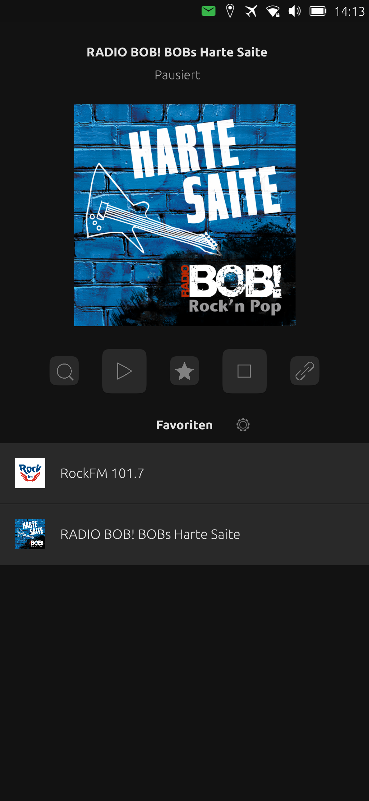

# Radio

App for playing webradio streams

# Features

Allows to play music streams, which can be searched via the built-in search function, or added manually (by supplying a valid URL to a supported audio stream).

Streams can be saved as favourite for quick and easy access.

The search is powered by the awesome https://www.radio-browser.info.

## License

Copyright (C) 2021-2022 Patrick Fial

Licensed under the MIT license

## Requirements

Create a file `metadata.sh` in /home/phablet/Downloads with the following content:    

-----------------------------------------------------------

#!/bin/sh

dbus-send --print-reply --dest=org.mpris.MediaPlayer2.MediaHub /org/mpris/MediaPlayer2 org.freedesktop.DBus.Properties.Get string:'org.mpris.MediaPlayer2.Player' string:'Metadata' | sed -n '/xesam:title/{ n; p }' | grep -oP '(?<=\").*(?=\")'

-----------------------------------------------------------

and give it full permissions in terminal with:

`cd ~/Downloads && sudo chmod a+xrw metadata.sh`

**Keep in mind that:**
  
-it is an unconfined app with full access to the system  
-only for arm64  

## Download

You can try this artifact from Actions:

